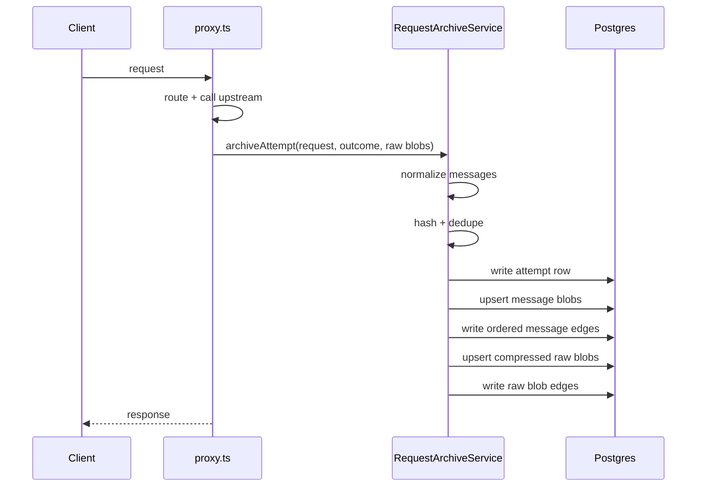

# Prompt Storage Design

## Goal

Add durable full-fidelity prompt/response storage to Innies so request content is stored in Postgres as a canonical normalized graph, not just as lightweight previews.

The user explicitly wants:

- full prompt and response storage
- no privacy boundary on stored content
- no retention expiry for archived content
- per-message dedupe
- global dedupe across all orgs
- storage for successful, failed, and partial attempts
- first-class storage for all content types:
  - `system`
  - `user`
  - `assistant`
  - tool calls
  - tool results
  - other structured parts
- final normalized streaming output plus a secondary raw stream blob

## Problem

Innies currently stores:

- routing metadata in `in_routing_events`
- metering/billing data in `in_usage_ledger` and `in_canonical_metering_events`
- prompt/response previews in `in_request_log`

That is sufficient for routing and operational analytics, but it is the wrong shape for full prompt archival:

- `in_request_log` is preview-oriented, not canonical
- filling `full_prompt_encrypted` / `full_response_encrypted` would duplicate prior history on every turn
- repeated message history such as `x,y` then `x,y,z` would store `x` and `y` multiple times
- streaming traffic has no canonical long-term storage model today

The user wants storage first, not prompt analytics yet. The design should therefore optimize for:

- exact storage fidelity
- dedupe correctness
- additive rollout with minimal regression risk to current analytics/UI paths

## Scope

In scope:

- new canonical archive tables for full request content
- normalized message/part storage with global per-message dedupe
- raw request/response/blob storage as secondary archival material
- proxy/runtime integration for:
  - non-streaming success
  - streaming success
  - failed attempts
  - partial attempts
- tests for dedupe, normalization, archival writes, and rollback behavior

Out of scope:

- user-facing analytics on archived prompt content
- new dashboard or admin UI for browsing archive data
- retention/deletion policy
- privacy redaction, PII filtering, or tenant-isolated dedupe
- historical conversation stitching beyond optional metadata captured when available

## Current State

Relevant current paths:

- request ingress and route wiring:
  - `api/src/server.ts`
  - `api/src/routes/anthropicCompat.ts`
  - `api/src/routes/proxy.ts`
- current prompt preview extraction:
  - `api/src/utils/requestLogPreview.ts`
- current preview store:
  - `api/src/repos/requestLogRepository.ts`
- current routing/metering stores:
  - `api/src/repos/routingEventsRepository.ts`
  - `api/src/repos/usageLedgerRepository.ts`
  - `api/src/repos/canonicalMeteringRepository.ts`

Important constraint:

- existing preview/query flows should keep working without waiting for the new archive to replace them

## Design Summary

Use an additive archival subsystem.

Do **not** expand `in_request_log` into the primary archive.

Instead:

- keep `in_request_log` as the lightweight preview/read model
- add a new canonical storage layer for full content
- write archive records from the shared proxy execution path
- preserve the current routing/metering tables as operational and financial truth

## Why Not Reuse `in_request_log`

Reusing `in_request_log.full_prompt_encrypted` and `full_response_encrypted` is the wrong design because:

- it stores full request payloads at the attempt level, which duplicates repeated history
- it does not model ordered request/response messages cleanly
- it does not support global dedupe
- it couples long-term archival to a lightweight analytics table
- it makes future prompt analytics harder because the canonical unit is the whole request blob, not the message

`in_request_log` should remain the fast preview layer.

## Data Model

### 1. `in_request_attempt_archives`

One row per archived request attempt.

Purpose:

- parent record for all normalized and raw content attached to one attempt

Suggested fields:

- `id`
- `request_id`
- `attempt_no`
- `org_id`
- `api_key_id`
- `route_kind`
  - `seller_key`
  - `token_credential`
- `seller_key_id`
- `token_credential_id`
- `provider`
- `model`
- `streaming`
- `status`
  - `success`
  - `failed`
  - `partial`
- `upstream_status`
- `error_code`
- `started_at`
- `completed_at`
- optional correlation fields when present:
  - `openclaw_run_id`
  - `openclaw_session_id`
- optional foreign-key-ish references to existing truth tables:
  - routing event identity
  - usage/metering event identity
- `created_at`

Uniqueness:

- unique on `(org_id, request_id, attempt_no)`

### 2. `in_message_blobs`

Globally deduped canonical normalized message records.

Purpose:

- store each distinct normalized message/part payload once

Suggested fields:

- `id`
- `content_hash`
- `kind`
  - `message`
  - `part`
- `role`
  - nullable for non-message parts
- `content_type`
  - `text`
  - `tool_call`
  - `tool_result`
  - `json`
  - `image`
  - etc
- `normalized_payload`
- `normalized_payload_codec_version`
- `created_at`

Uniqueness:

- unique on `content_hash`

Hash input:

- canonical normalized JSON
- stable key ordering
- exact array ordering preserved
- no org scoping

### 3. `in_request_attempt_messages`

Ordered edge table from archived request attempt to canonical normalized message blobs.

Purpose:

- reconstruct request-side and response-side sequences without duplicating message storage

Suggested fields:

- `request_attempt_archive_id`
- `side`
  - `request`
  - `response`
- `ordinal`
- `message_blob_id`
- `role`
- `content_type`
- `created_at`

Primary key:

- `(request_attempt_archive_id, side, ordinal)`

### 4. `in_raw_blobs`

Content-addressed compressed raw archival blobs.

Purpose:

- retain exact wire payloads for replay/debug/forensics
- avoid mixing raw transport data with normalized canonical message storage

Suggested fields:

- `id`
- `content_hash`
- `blob_kind`
  - `raw_request`
  - `raw_response`
  - `raw_stream`
- `encoding`
  - `gzip`
  - `none`
- `bytes_compressed`
- `bytes_uncompressed`
- `payload`
- `created_at`

Uniqueness:

- unique on `(content_hash, blob_kind)`

### 5. `in_request_attempt_raw_blobs`

Edge table linking a request attempt to its raw blobs.

Purpose:

- make raw storage optional and separable from normalized storage

Suggested fields:

- `request_attempt_archive_id`
- `blob_role`
  - `request`
  - `response`
  - `stream`
- `raw_blob_id`
- `created_at`

Primary key:

- `(request_attempt_archive_id, blob_role)`

## Canonical Storage Rules

### Dedupe Unit

Dedupe unit is **one normalized message/part object**, not a whole request and not arbitrary text fragments.

Example:

- request 1: `x`, `y`
- request 2: `x`, `y`, `z`

Stored outcome:

- `x` stored once
- `y` stored once
- `z` stored once
- attempt 1 edges point to `x`, `y`
- attempt 2 edges point to `x`, `y`, `z`

### Dedupe Scope

Dedupe is **global across Innies**, not per org.

Implication:

- the same normalized message content in different orgs points to one `in_message_blobs` row
- per-attempt ownership and attribution still stay isolated in edge/attempt rows

### Streaming Canonical Rule

For streaming requests:

- canonical normalized response = final assembled output
- raw stream events = separate secondary raw blob

This keeps the query model clean while still preserving exact transport history.

### Failure Rule

Archive both:

- successful attempts
- failed and partial attempts

If only partial assistant output exists, store what exists and mark the parent attempt as `partial`.

### Content Coverage Rule

Normalize and store all content types that appear in request or response payloads:

- `system`
- `user`
- `assistant`
- tool calls
- tool results
- structured JSON blocks
- stream-derived final assistant output

## Normalization Model

Normalization should be provider-agnostic where possible and lossy nowhere that matters for meaning.

Rules:

- use stable JSON serialization before hashing
- preserve sequence order
- preserve exact text
- preserve role and content type
- preserve tool call identity and arguments
- preserve tool results exactly
- preserve provider-specific metadata in payload fields when needed

The normalized graph is the canonical application model.

Raw wire payloads remain separately archived so canonical normalization does not need to preserve every transport quirk.

## Compression Model

Compress before writing raw blobs to Postgres.

Decision:

- always compress `in_raw_blobs.payload`
- do not require compression for `in_message_blobs.normalized_payload` in v1

Reasoning:

- raw request/response/stream payloads can be large and repetitive
- compression gives immediate storage savings
- normalized message rows are smaller and are already deduped aggressively

Initial codec:

- `gzip`

This should be implemented in a dedicated archival codec/helper, not by reusing the existing secret-encryption helper intended for credentials.

## Write Path

Add a dedicated service:

- `RequestArchiveService`

This service owns:

- normalization
- hashing
- dedupe upserts
- raw blob compression
- transactional writes

Do not scatter archival logic directly through route files.

### Main Hook Points

Archive writes should be invoked from the shared proxy execution path in `api/src/routes/proxy.ts`.

Primary call sites:

- non-streaming token success path
- streaming token success/finalization path
- seller-key success path
- failure paths once request outcome is known

Compat traffic through `POST /v1/messages` should continue to archive through the shared proxy handler, not through a separate compat-only storage path.

### Transaction Boundary

Archive one attempt in one transaction:

1. insert/upsert parent `in_request_attempt_archives` row
2. normalize request messages
3. normalize response messages if present
4. upsert deduped `in_message_blobs`
5. insert ordered edges into `in_request_attempt_messages`
6. compress and upsert `in_raw_blobs`
7. insert raw blob edges

If any part fails, roll back the entire archive write.

### Availability vs Completeness

Make archival **blocking**, not best-effort.

Reasoning:

- the user wants storage to be durable and complete
- silent archival loss would poison future analysis
- a hard failure is operationally obvious and recoverable

If this proves too risky operationally, a later phase can add a durable outbox/async archive worker. That is not the v1 design.

## Flow Diagram

## Read Model Boundary

Do not migrate current dashboards/analytics to the archive in this change.

Keep:

- `in_request_log` for previews
- `in_routing_events` for routing analysis
- `in_usage_ledger` and `in_canonical_metering_events` for metering/financial truth

The new archive is long-term canonical storage, not an immediate replacement for every current query.

## Migration Plan

### Schema Phase

Add migrations for:

- `in_request_attempt_archives`
- `in_message_blobs`
- `in_request_attempt_messages`
- `in_raw_blobs`
- `in_request_attempt_raw_blobs`

Add indexes for:

- lookup by `(org_id, created_at desc)`
- lookup by `(request_id, attempt_no)`
- `content_hash`
- ordered reconstruction by `(request_attempt_archive_id, side, ordinal)`

### Runtime Phase

Add:

- repository classes for the new tables
- `RequestArchiveService`
- proxy integration behind a feature flag if desired

### Backfill

No backfill is required for v1 because current tables do not contain full request content.

## Testing

Use TDD.

Required tests:

- repository test: identical normalized message content upserts once
- repository test: global dedupe works across different orgs
- service test: `x,y` then `x,y,z` stores only one new message blob
- service test: raw blob compression metadata is recorded correctly
- service test: transaction rollback leaves no orphaned rows
- route test: non-streaming success archives request + response
- route test: streaming success archives final normalized output + raw stream blob
- route test: failed attempt archives request and failure metadata
- route test: partial attempt archives partial response and marks status correctly

## Risks

- storage growth will be significant because retention is forever
- blocking archival writes add latency and failure surface to proxy requests
- normalization bugs could create bad dedupe keys
- provider-specific payload shapes may require ongoing normalization maintenance

## Open Decisions Resolved In This Design

- full content storage: yes
- retention expiry: none
- canonical model: normalized message graph
- raw wire payloads: yes, as secondary compressed blobs
- dedupe unit: per normalized message/part
- dedupe scope: global
- streaming canonical form: final output + raw stream blob
- failed/partial attempts: stored
- content types: all first-class
- write strategy: blocking transactional archive writes

## Recommended Implementation Order

1. schema migrations
2. archival codec + canonical hash helpers
3. repositories for new archive tables
4. `RequestArchiveService`
5. non-streaming proxy integration
6. streaming proxy integration
7. failure/partial archive paths
8. regression and rollback tests
