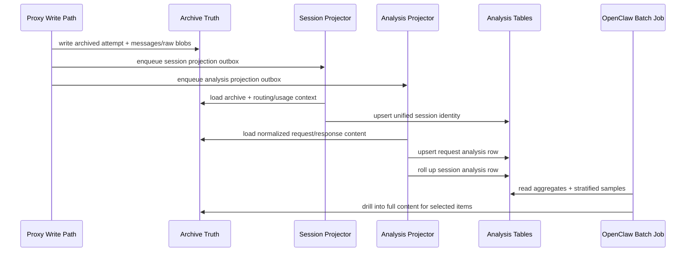

# Admin Analysis Substrate Design

## Goal

Add a new admin-only analysis substrate that gives OpenClaw a strong batch-analysis surface for:

- macro analysis
  - what teams are working on over time
  - how task mix changes by day/week
  - which providers/models/sources correlate with which kinds of work
- micro analysis
  - finding one interesting request, attempt, or session
  - drilling into full content for validation
  - generating tweet-worthy observations outside the API layer

The user explicitly wants:

- daily batch analysis as the primary use case
- full content available for trusted agent drilldown
- one API that supports both macro and micro analysis
- backend precomputation of durable primitives, but not backend tweet generation
- request-level truth plus session-level rollups
- historical backfill, not forward-only enrichment
- a dedicated admin analysis branch in addition to existing analytics/archive endpoints

## Context

Innies already has three relevant data surfaces:

1. lightweight preview analytics
   - `in_request_log`
   - existing `/v1/admin/analytics/*`
2. full-fidelity archive truth
   - `in_request_attempt_archives`
   - `in_request_attempt_messages`
   - `in_message_blobs`
   - `in_request_attempt_raw_blobs`
   - `in_raw_blobs`
3. unified session projection
   - `in_admin_session_projection_outbox`
   - `in_admin_sessions`
   - `in_admin_session_attempts`
   - existing `/v1/admin/archive/*`

The existing preview path is not enough for the user's analysis goal:

- request previews are truncated from the front
- Anthropic request previews currently start with `system`, so long system prompts crowd out the actual user task
- response previews can degrade when SSE event shapes are not parsed deeply enough
- `/v1/admin/analytics/requests` is latest-first, so it is recency-biased rather than representative over a full day or week

The archive truth tables do contain the right semantic content, but they are not the right hot read shape for repeated OpenClaw batch analysis.

## Scope

In scope:

- a new admin analysis branch under `/v1/admin/analysis/*`
- new request-level and session-level analysis projections
- deterministic write-time and backfill-time derivation of:
  - `userMessagePreview`
  - `assistantTextPreview`
  - `taskCategory`
  - `taskTags`
  - cheap interestingness signals
- full-window aggregate endpoints
- stratified sample endpoints
- exact analysis detail endpoints that link cleanly to archive drilldown
- a one-off historical backfill path over archived attempts
- docs, tests, migrations, projector job wiring

Out of scope:

- backend tweet generation
- LLM-based categorization inside Innies
- public-safe or anonymous analysis endpoints
- replacing the existing `/v1/admin/analytics/*` ops-oriented endpoints
- replacing the existing `/v1/admin/archive/*` full-detail endpoints
- solving every future clustering/ranking use case in v1

## Design Summary

Implement this as a new admin analysis subsystem that sits between:

- canonical archive truth
- existing session projection
- OpenClaw batch analysis consumers

Do not overload `in_request_log`.

Do not force OpenClaw to repeatedly reconstruct the same semantic fields from giant prompts/responses.

Instead:

- keep archive tables as write-side truth
- reuse existing unified session identity from `in_admin_sessions`
- add a dedicated analysis projection for requests and sessions
- derive stable, deterministic qualitative fields once
- expose three API layers:
  - aggregate
  - stratified sample
  - exact drilldown

OpenClaw remains responsible for:

- higher-order synthesis
- ranking final interesting items
- tweet drafting
- overriding backend heuristics when desired

## Why Not Extend `in_request_log`

`in_request_log` is the wrong substrate for this feature.

Reasons:

- it is a preview-oriented table, not canonical truth
- it is populated from the proxy write path rather than reconstructed from normalized archive messages
- its current semantics are head-biased and recency-biased
- expanding it into the primary analysis store would mix:
  - operational preview concerns
  - qualitative analysis concerns
  - full-history backfill concerns

The correct role for `in_request_log` remains:

- cheap preview reads for existing analytics

The new analysis layer should be archive-backed and backfillable.

## Storage Architecture

### Existing Truth And Identity Layers

Continue using:

- archive truth tables for content fidelity
- admin session projection tables for unified session identity

The new analysis layer should not invent a second session identity system.

### New Projection Tables

Add a dedicated analysis projection layer.

#### 1. `in_admin_analysis_request_projection_outbox`

Purpose:

- durable queue for request-analysis projection
- same operational shape as the existing session projector
- supports both forward writes and backfill/replay

Suggested fields:

- `id`
- `request_attempt_archive_id`
- `projection_state`
  - `pending_projection`
  - `projected`
  - `needs_operator_correction`
- `retry_count`
- `next_attempt_at`
- `last_attempted_at`
- `processed_at`
- `last_error`
- `created_at`
- `updated_at`

Uniqueness:

- unique on `request_attempt_archive_id`

#### 2. `in_admin_analysis_requests`

Purpose:

- one row per archived request attempt
- durable analysis substrate for macro aggregation and qualitative sampling

Suggested fields:

- identity and joins
  - `request_attempt_archive_id`
  - `request_id`
  - `attempt_no`
  - `session_key`
- dimensions
  - `org_id`
  - `api_key_id`
  - `session_type`
  - `grouping_basis`
  - `source`
  - `provider`
  - `model`
  - `status`
  - `started_at`
  - `completed_at`
- usage
  - `input_tokens`
  - `output_tokens`
- qualitative fields
  - `user_message_preview`
  - `assistant_text_preview`
  - `task_category`
  - `task_tags`
- cheap ranking signals
  - `is_retry`
  - `is_failure`
  - `is_partial`
  - `is_high_token`
  - `is_cross_provider_rescue`
  - `has_tool_use`
  - `interestingness_score`
- timestamps
  - `created_at`
  - `updated_at`

Notes:

- `request_attempt_archive_id` should be the durable identity key
- `session_key` should reference the existing unified session projection
- `task_tags` can be `text[]`
- signal fields should be concrete columns, not opaque JSON, so SQL aggregation stays cheap

#### 3. `in_admin_analysis_sessions`

Purpose:

- one row per unified session with qualitative rollups
- batch-friendly session analysis surface without replaying all request rows each time

Suggested fields:

- identity
  - `session_key`
- dimensions
  - `org_id`
  - `session_type`
  - `grouping_basis`
- summary
  - `started_at`
  - `ended_at`
  - `last_activity_at`
  - `request_count`
  - `attempt_count`
  - `input_tokens`
  - `output_tokens`
- qualitative rollups
  - `primary_task_category`
  - `task_category_breakdown`
  - `task_tag_set`
- cheap ranking signals
  - `is_long_session`
  - `is_high_token_session`
  - `is_retry_heavy_session`
  - `is_cross_provider_session`
  - `is_multi_model_session`
  - `interestingness_score`
- timestamps
  - `created_at`
  - `updated_at`

Notes:

- this table should roll up from `in_admin_analysis_requests`
- keep the rollups deterministic and easy to recompute

## Qualitative Derivation Rules

### Request-Level Source Of Truth

Request-level analysis rows are the truth source.

Session-level analysis rows are rollups only.

This keeps:

- daily trends stable
- one-request interesting moments visible
- mixed-purpose sessions from obscuring request-level intent

### `userMessagePreview`

Do not derive this from `in_request_log.prompt_preview`.

Derive it from normalized archived request messages:

1. load ordered request-side normalized messages from `in_request_attempt_messages` + `in_message_blobs`
2. find the last message with `role = 'user'`
3. extract text-bearing content from that message
4. if no `role='user'` message exists, fall back to the latest text-bearing request content
5. truncate to a bounded size

Recommended v1 size:

- `1000..2000` chars

This is the most important qualitative field in the whole design.

### `assistantTextPreview`

Do not store raw SSE protocol strings.

Derive it from normalized archived response messages when available, or from parsed response payloads during projection if the archive content requires a fallback.

Rules:

1. prefer normalized archived response messages
2. extract actual assistant text-bearing content
3. ignore protocol wrapper text such as:
   - `event: message_start`
   - SSE frame labels
   - transport metadata
4. truncate to a bounded size

Recommended v1 size:

- `1000..2000` chars

### `taskCategory`

Backend writes one coarse deterministic category.

Recommended v1 enum:

- `debugging`
- `feature_building`
- `code_review`
- `research`
- `ops`
- `writing`
- `data_analysis`
- `other`

Classification input should primarily use:

- `userMessagePreview`
- optionally `assistantTextPreview`

No LLM calls in v1.

### `taskTags`

Backend writes zero or more lightweight deterministic tags.

Examples:

- `react`
- `typescript`
- `postgres`
- `auth`
- `billing`
- `migration`
- `sse`
- `openai`
- `anthropic`
- `deployment`
- `performance`

Tags should be:

- additive
- non-exclusive
- stable enough for frequency and co-occurrence analysis

### Cheap Interestingness Signals

The backend should expose cheap ranking primitives, not final “interesting item” decisions.

Request-level examples:

- `is_retry`
- `is_failure`
- `is_partial`
- `is_high_token`
- `is_cross_provider_rescue`
- `has_tool_use`

Session-level examples:

- `is_long_session`
- `is_high_token_session`
- `is_retry_heavy_session`
- `is_cross_provider_session`
- `is_multi_model_session`

These should remain mechanical and SQL-friendly.

## Runtime Flow

Forward path:

1. archive write succeeds
2. analysis outbox row is enqueued transactionally
3. analysis projector consumes that row
4. projector loads:
   - archive truth
   - usage
   - routing/source metadata
   - session identity
5. projector writes request analysis row
6. projector upserts session rollup row

The analysis projector should be independent from the existing session projector for retry/backfill reasons, but it should depend on the existing `session_key` projection rather than recreating session grouping.

## Historical Backfill

V1 requires historical backfill.

Recommended shape:

- one backfill command inserts missing archive ids into `in_admin_analysis_request_projection_outbox`
- the same analysis projector code handles both:
  - forward traffic
  - historical replay

Backfill should:

- scan archived attempts in windowed batches
- skip already-projected archive ids
- rely on the same deterministic derivation rules as live traffic
- be restart-safe and idempotent

The backfill should not require a separate classification code path.

## API Surface

All new endpoints stay admin-only and use the existing `admin` API key scope.

### Aggregate Layer

#### `GET /v1/admin/analysis/overview`

Purpose:

- one summary snapshot for a full analysis window

Accepted filters:

- `window`
- `orgId`
- `sessionType`
- `provider`
- `source`
- `taskCategory`
- `taskTag`

Response shape:

- total requests
- total sessions
- total tokens
- category mix
- tag highlights
- signal counts

#### `GET /v1/admin/analysis/categories`

Purpose:

- category trend analysis over time

Accepted filters:

- `window`
- `orgId`
- `sessionType`
- `provider`
- `source`

Response shape:

- per-category totals
- day buckets with category breakdowns
- optional provider/source splits by category

#### `GET /v1/admin/analysis/tags`

Purpose:

- tag frequency and co-occurrence analysis

Accepted filters:

- `window`
- `orgId`
- `sessionType`
- `provider`
- `source`
- `taskCategory`

Response shape:

- top tags
- tag counts
- optional co-occurring tags

#### `GET /v1/admin/analysis/interesting-signals`

Purpose:

- macro counts for mechanical “interestingness” dimensions

Response shape:

- counts for retry-heavy, high-token, cross-provider, failure, partial, tool-use, long-session, etc.

### Stratified Sample Layer

#### `GET /v1/admin/analysis/samples/requests`

Purpose:

- representative qualitative request sample over a full window

Accepted filters:

- `window`
- `orgId`
- `sessionType`
- `provider`
- `source`
- `taskCategory`
- `taskTag`
- `sampleSize`

Behavior:

- stratify across:
  - time buckets
  - categories
  - optionally source/provider
- do not simply return latest N

Response shape:

- sampled request analysis rows
- enough metadata to decide whether to drill into archive detail

#### `GET /v1/admin/analysis/samples/sessions`

Purpose:

- representative qualitative session sample

Accepted filters:

- same family as request samples

Behavior:

- stratify across time buckets and primary categories
- return linked session summary rows plus representative analysis fields

### Analysis Detail Layer

#### `GET /v1/admin/analysis/requests/:requestId/attempts/:attemptNo`

Purpose:

- fetch one request-analysis row plus direct pointers to archive detail

Response shape:

- request-level analysis fields
- signal fields
- session key
- archive references

#### `GET /v1/admin/analysis/sessions/:sessionKey`

Purpose:

- fetch one session-analysis row plus request/category rollups

Response shape:

- session-level rollups
- representative request refs
- category breakdown
- tag set

### Full Drilldown

OpenClaw should continue using the existing archive endpoints for exact content:

- `GET /v1/admin/archive/sessions/:sessionKey`
- `GET /v1/admin/archive/sessions/:sessionKey/events`
- `GET /v1/admin/archive/requests/:requestId/attempts/:attemptNo`

The new analysis branch should point to these surfaces rather than duplicating full content.

## Sampling Semantics

The API must support both:

- full-window truth for aggregates
- stratified representative samples for qualitative scanning

V1 should use server-controlled stratification rather than exposing a large sampler DSL.

That keeps:

- semantics stable
- OpenClaw simple
- room for future strategy parameters without locking in a bad API now

## Rollout

1. land analysis projection schema
2. land request/session analysis projector services and job
3. enqueue analysis projection on new archive writes
4. expose `/v1/admin/analysis/*`
5. run historical backfill
6. validate category/tag/signal quality on a real sample

Operationally:

- the new endpoints should work on partially backfilled data
- responses should expose freshness/backfill status where useful so OpenClaw knows whether the window is complete

## Testing

Required coverage:

- migration contract tests
- request/session analysis repository tests
- request qualitative derivation tests
  - last user message extraction
  - assistant text extraction
  - SSE/protocol wrapper stripping
- classifier/tagger heuristic tests
- projector service tests
  - forward projection
  - session rollup updates
  - idempotent replay
- projector job tests
- backfill command tests
- route tests for:
  - aggregate endpoints
  - stratified sample endpoints
  - analysis detail endpoints

## Non-Goals Reaffirmed

This feature should not:

- make the backend choose tweet winners
- make OpenClaw depend on latest-N recency feeds
- turn `in_request_log` into the primary analysis store
- require returning huge full prompts from aggregate endpoints
- make the analysis layer the canonical content truth

## Recommendation

Build this as a dedicated admin analysis substrate on top of archive truth and session identity.

That gives OpenClaw:

- durable macro trend inputs
- representative qualitative samples
- exact full drilldown when needed

without forcing the API layer to become the analysis brain itself.
