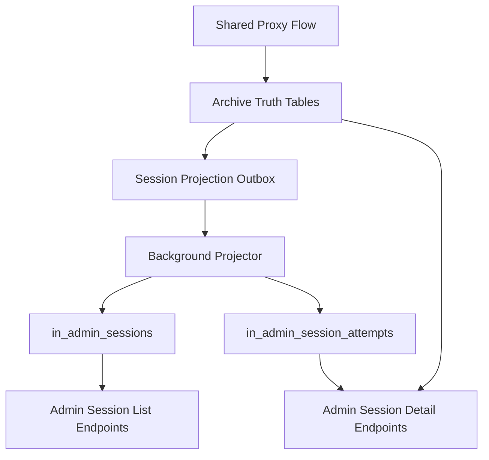

# Admin Session Archive API Design

## Goal

Add Innies admin endpoints for serving unified CLI and OpenClaw session data from the existing prompt archive, with a contract that is native to the current `/v1/admin/...` surface and suitable for both analytics and full-fidelity session playback.

The user explicitly wants:

- admin-only consumers in v1
- the same overall feel as existing Innies admin endpoints
- one unified session surface for both CLI and OpenClaw traffic
- data-serving only for now
- future optional use by an OpenClaw agent, but without making OpenClaw define the API boundary

## Context

Innies already has:

- a lightweight preview/read model in `in_request_log`
- an admin analytics surface under `/v1/admin/analytics/...`
- canonical prompt archive storage in:
  - `in_request_attempt_archives`
  - `in_message_blobs`
  - `in_request_attempt_messages`
  - `in_raw_blobs`
  - `in_request_attempt_raw_blobs`

The archive storage is the right write-side truth, but it is not the right hot read shape for admin session browsing:

- session reconstruction would otherwise require repeated joins across dedupe tables
- raw artifacts may require decompression
- storage ids such as blob ids and content hashes are internal persistence concerns, not API concepts

## Non-Goals

Out of scope for this work:

- public site endpoints
- public-safe content projection
- live site transport or frontend UI
- OpenClaw-specific endpoint families
- replacing existing preview analytics with archive-backed reads everywhere
- broad auth hardening beyond fitting the new routes into the existing admin surface

## Design Summary

Implement this as a new admin archive/session branch under `/v1/admin/...`.

Do not expose the archive graph directly.

Instead:

- keep the current archive tables as canonical write-side truth
- keep lightweight analytics and preview reads on the existing admin analytics surface
- add a small admin session projection layer for unified session lookup
- reconstruct full attempts and session event playback server-side

OpenClaw, CLI wrappers, and any future admin clients should consume the same Innies-owned admin API.

## Session Model

Use one unified Innies session concept for all admin consumers.

Core fields:

- `sessionKey`
  - Innies-owned opaque stable identifier
- `sessionType`
  - `cli`
  - `openclaw`
- `groupingBasis`
  - `explicit_session_id`
  - `explicit_run_id`
  - `idle_gap`
  - `request_fallback`
- optional source-native correlation fields:
  - `sourceSessionId`
  - `sourceRunId`

The API should not make `openclaw_session_id` the global session identity.

Instead:

- preserve source-native ids as metadata
- expose a unified Innies session identity to clients
- allow filtering by `sessionType`

## Session Grouping Rules

Group requests into unified sessions using the following precedence:

1. explicit source session id
2. explicit source run id
3. derived idle-gap grouping within the same source/org/provider lane
4. fallback singleton session keyed to one request when no stronger signal exists

Practical guidance:

- OpenClaw traffic should use `openclaw_session_id` first when present
- OpenClaw traffic should fall back to `openclaw_run_id` when session id is absent
- CLI traffic should use any explicit Innies or wrapper session marker when present
- when no explicit marker exists, derive sessions with an idle-gap rule

This keeps v1 useful even while some clients may not yet emit ideal session markers.

## Storage Architecture

### Write-Side Truth

Keep the current archive subsystem as the canonical source of truth:

- `in_request_attempt_archives`
- `in_message_blobs`
- `in_request_attempt_messages`
- `in_raw_blobs`
- `in_request_attempt_raw_blobs`

No change in ownership:

- archive tables remain responsible for fidelity and dedupe correctness
- preview tables remain responsible for cheap preview reads

### New Projection Tables

Add a small projection layer for admin session reads.

#### 1. `in_admin_session_projection_outbox`

Purpose:

- durable projector queue
- decouple request serving from session projection

Suggested fields:

- `id`
- `request_attempt_archive_id`
- `request_id`
- `attempt_no`
- `org_id`
- `session_type`
- `created_at`
- `processed_at`
- `error_count`
- `last_error`

#### 2. `in_admin_sessions`

Purpose:

- one row per unified session
- fast session list and analytics reads

Suggested fields:

- `session_key`
- `session_type`
- `grouping_basis`
- `org_id`
- `source_session_id`
- `source_run_id`
- `started_at`
- `ended_at`
- `last_activity_at`
- `request_count`
- `attempt_count`
- `input_tokens`
- `output_tokens`
- `provider_set`
- `model_set`
- `status_summary`
- `preview_sample`
- `created_at`
- `updated_at`

#### 3. `in_admin_session_attempts`

Purpose:

- ordered mapping from a session to archived attempts
- stable playback lookup without duplicating full content

Suggested fields:

- `session_key`
- `request_attempt_archive_id`
- `request_id`
- `attempt_no`
- `event_time`
- `sequence_no`
- `provider`
- `model`
- `streaming`
- `status`
- `created_at`

Uniqueness:

- unique on `(session_key, request_attempt_archive_id)`
- stable ordering on `(event_time, request_id, attempt_no, sequence_no)`

### Why This Projection Layer Exists

This avoids the two wrong extremes:

- exposing dedupe/blob internals to clients
- copying full prompt/response content into a second long-term store

The admin session projection should store grouping and summary data only.
Full content stays in the archive truth tables.

## Read Path

### Analytics Reads

Analytics endpoints should continue to prefer cheap read models:

- `in_request_log`
- existing analytics tables and joins
- `in_admin_sessions` for session summaries

These endpoints should not scan raw blobs or reconstruct full message graphs on every request.

### Archive Detail Reads

Full detail endpoints should reconstruct content server-side:

1. load `in_admin_session_attempts`
2. load the referenced `in_request_attempt_archives`
3. load ordered `in_request_attempt_messages`
4. join to `in_message_blobs`
5. optionally load `in_request_attempt_raw_blobs`
6. join to `in_raw_blobs`
7. decompress raw payloads only when explicitly requested

Clients should never need to understand:

- `message_blob_id`
- `raw_blob_id`
- `content_hash`
- gzip encoding details

## API Surface

Keep the API inside the existing admin namespace and style.

### 1. `GET /v1/admin/analytics/sessions`

Purpose:

- fast analytics/session summary feed

Accepted filters:

- `window`
- `sessionType`
  - `cli`
  - `openclaw`
- `orgId`
- `provider`
- `model`
- `status`
- `limit`
- `cursor`

Response shape:

- `window`
- `limit`
- `sessions`
  - `sessionKey`
  - `sessionType`
  - `groupingBasis`
  - `startedAt`
  - `endedAt`
  - `durationMs`
  - `requestCount`
  - `attemptCount`
  - `inputTokens`
  - `outputTokens`
  - `providerSet`
  - `modelSet`
  - `statusSummary`
  - `previewSample`
- `nextCursor`

### 2. `GET /v1/admin/archive/sessions`

Purpose:

- paginated admin session index for full-fidelity consumers

Accepted filters:

- `window`
- `sessionType`
- `orgId`
- `provider`
- `model`
- `status`
- `limit`
- `cursor`

Response shape:

- `window`
- `limit`
- `sessions`
  - `sessionKey`
  - `sessionType`
  - `groupingBasis`
  - `sourceSessionId`
  - `sourceRunId`
  - `orgId`
  - `startedAt`
  - `endedAt`
  - `durationMs`
  - `requestCount`
  - `attemptCount`
  - `inputTokens`
  - `outputTokens`
  - `providerSet`
  - `modelSet`
  - `statusSummary`
  - `previewSample`
- `nextCursor`

### 3. `GET /v1/admin/archive/sessions/:sessionKey`

Purpose:

- session header plus aggregate detail

Response shape:

- `session`
  - `sessionKey`
  - `sessionType`
  - `groupingBasis`
  - `sourceSessionId`
  - `sourceRunId`
  - `orgId`
  - `startedAt`
  - `endedAt`
  - `durationMs`
  - `requestCount`
  - `attemptCount`
  - `inputTokens`
  - `outputTokens`
  - `providerSet`
  - `modelSet`
  - `statusSummary`
  - `previewSample`
  - `firstRequestRef`
  - `lastRequestRef`

### 4. `GET /v1/admin/archive/sessions/:sessionKey/events`

Purpose:

- ordered full-fidelity playback feed

Accepted filters:

- `limit`
- `cursor`

Response shape:

- `sessionKey`
- `events`
  - `eventType`
    - `request_message`
    - `response_message`
    - `attempt_status`
  - `eventTime`
  - `requestId`
  - `attemptNo`
  - `ordinal`
  - `side`
    - `request`
    - `response`
  - `role`
  - `contentType`
  - `content`
  - `provider`
  - `model`
  - `streaming`
  - `status`
  - `upstreamStatus`
- `nextCursor`

This is the main endpoint for admin playback consumers.

### 5. `GET /v1/admin/archive/requests/:requestId/attempts/:attemptNo`

Purpose:

- exact attempt drilldown for debugging

Response shape:

- `attempt`
  - request metadata
  - route metadata
  - timestamps
  - status fields
  - source correlation ids
- `request`
  - ordered normalized messages
- `response`
  - ordered normalized messages
- `raw`
  - request/response/stream raw artifact metadata

### 6. Optional `GET /v1/admin/archive/raw-blobs/:blobId`

Purpose:

- explicit debug/download path only

Behavior:

- return metadata by default
- require an explicit query flag to return decompressed bytes or decoded UTF-8

## Response Semantics

Rules:

- list endpoints return paginated summaries only
- full content is available only on detail/playback endpoints
- unknown `sessionKey` returns `404`
- empty result sets return `200` with empty arrays
- cursor ordering must be stable and descending for list endpoints
- event ordering must be stable and ascending within a session playback feed

Recommended ordering:

- session lists: `(last_activity_at desc, session_key desc)`
- session events: `(event_time asc, request_id asc, attempt_no asc, ordinal asc)`

## Auth

Fit the new routes into the existing admin auth pattern.

V1 recommendation:

- protect these routes with the existing admin API key scope
- keep the routes feeling native to the current admin surface

Follow-up hardening can later introduce a read-only admin observer scope, but that should not block the v1 archive/session API.

## Infra Approach

Keep this Postgres-first.

Do not introduce Kafka, Redis streams, or a separate event platform for v1.

Recommended runtime shape:

- request handler writes archive truth
- same request lifecycle also records one outbox row
- a background projector processes outbox rows in batches
- projector upserts session summaries and attempt links

This keeps infra operationally simple while still avoiding expensive direct archive reconstruction on every list query.

## Testing

Add:

- repository tests for session grouping and ordering
- route tests for:
  - mixed CLI and OpenClaw sessions in one feed
  - `sessionType` filtering
  - cursor pagination
  - unknown-session `404`
  - session detail reconstruction
  - event playback ordering
- at least one end-to-end route test showing:
  - a CLI flow lands in the unified session feed
  - an OpenClaw flow lands in the unified session feed

Keep the style aligned with existing admin and analytics route tests.

## Rollout

Phase 1:

- add projection tables and projector
- add unified admin session analytics/index/detail endpoints
- keep raw blob access debug-only

Phase 2:

- add optional read-only admin observer scope
- improve grouping quality as more explicit session markers become available

Phase 3:

- if needed later, derive a separate public-safe projection from the same archive truth and session projection seams

## Open Questions

These do not block the v1 design, but they affect implementation detail:

- which explicit CLI session marker should become canonical when present
- exact idle-gap threshold for derived sessions
- whether event feeds should include synthesized attempt lifecycle markers beyond request/response content

## Recommendation

Ship this as a native Innies admin archive/session branch under `/v1/admin/...`, backed by a small Postgres session projection layer.

That gives:

- one unified session API for CLI and OpenClaw
- fast admin analytics/list reads
- canonical full-fidelity playback
- a clean future path for public or live projections later without redesigning the admin contract
